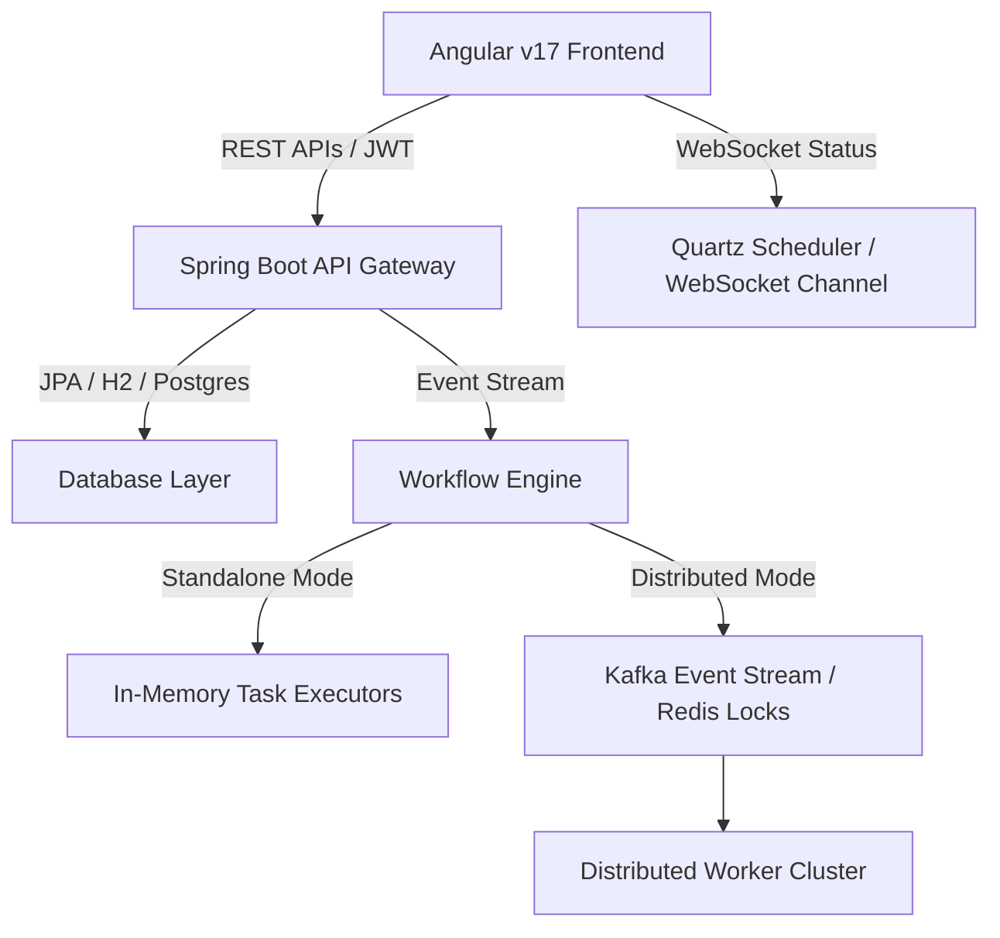

# FlowOrchestra 🌐

FlowOrchestra is an enterprise-grade, high-performance workflow orchestration platform designed for orchestrating complex system actions, automated scripts, and AI-driven tasks in real time. It offers a beautiful, modern graphite-dark visual pipeline designer, a robust multi-threaded execution engine, smart scheduling, and live execution tracing.

Inspired by industry standards like **Netflix Conductor** and **n8n**, FlowOrchestra provides a developer-friendly interface to build, execute, and monitor robust pipelines with minimal effort.

---

## 🚀 Key Features

* **Visual Pipeline Designer**:
  * Modern dark graphite theme with high-visibility grid workspaces.
  * Bidirectional connection wire dragging (flexible input-to-output and output-to-input link draws).
  * Auto-validation and hover warnings for disconnected or incomplete nodes.
* **Multi-Runner Task Execution Engine**:
  * **HTTP Request**: Full support for REST API endpoints with placeholders, methods (GET, POST, PUT, DELETE), headers, and request bodies.
  * **SSH Executor**: Executes shell commands on remote targets securely.
  * **Script Evaluator**: Evaluates complex SpEL (Spring Expression Language) expressions.
  * **Condition Switch**: Dynamic boolean path branching (True/False outputs).
  * **AI Prompt (New)**: Modern Generative AI LLM prompting integration supporting parameter temperature values, custom output variables, model selection (GPT-4o, Gemini 1.5, Claude 3), and simulated execution.
* **Real-time Monitoring & Websockets**: Live workflow tracking where node status changes (Pending ➔ Running ➔ Completed/Failed) pulse and update in real time.
* **Smart Cron Scheduler**: Trigger workflow executions automatically based on scheduled intervals.
* **Automatic Session Recovery & Security**: Stored session validation using JWT Bearer tokens with active interceptors to detect, clear, and redirect expired user sessions immediately.

---

## 🛠️ Architecture & Technology Stack



### Technical Stack
* **Frontend**: Angular (Standalone Components), RxJS, HTML5 Canvas, Google Material Icons.
* **Backend**: Spring Boot 3.3.0, Spring Security (JWT Stateless Auth), Spring Data JPA, Quartz Scheduler.
* **Databases**: H2 (In-memory development), PostgreSQL (Production).
* **Caching & Scaling**: Redis (Redisson distributed locks), Apache Kafka (Distributed execution).

---

## ⚙️ Project Profiles

FlowOrchestra runs in two distinct profiles, configured via [application.yml](file:///d:/Workflow%20Orchestration/Workflow%20Orchestration/backend/src/main/resources/application.yml):

1. **`local` (Standalone Development)**:
   * Uses an in-memory H2 database (`jdbc:h2:mem:flowdb`) accessible at `/h2-console`.
   * Disables Redis and Kafka requirements (bypasses auto-configuration) for instant, local execution.
   * Runs local task runners using dedicated thread pools.
2. **`prod` (Distributed Production)**:
   * Connects to a PostgreSQL database instance.
   * Leverages Kafka queues for distributing tasks to clustered execution agents.
   * Leverages Redis for active lock management across multiple gateway replicas.

---

## 🏁 Getting Started

### Prerequisites
* Java Development Kit (JDK) 17 or 21+
* Node.js (v18+) & npm
* Maven 3.8+

---

### 1. Running the Backend Server
Navigate to the `backend` directory and compile/run using Maven:

```bash
cd backend
# Build the project package
mvn clean package -DskipTests

# Run the Spring Boot application (using local profile)
mvn spring-boot:run
```

* **API Base URL**: `http://localhost:8081`
* **H2 Database Console**: `http://localhost:8081/h2-console` (JDBC URL: `jdbc:h2:mem:flowdb`, User: `sa`, Password: `password`)

---

### 2. Running the Frontend Developer Server
Navigate to the `frontend` directory, install packages, and start the Dev Server:

```bash
cd frontend
# Install dependencies
npm install

# Start the dev server
npm start
```

* **Web UI Access**: `http://localhost:4201`

---

## 🔐 Default Credentials

FlowOrchestra automatically seeds two accounts upon startup for quick evaluation:

| Role | Username | Password |
| :--- | :--- | :--- |
| **Administrator** | `admin` | `password` |
| **Developer** | `developer` | `password` |

---

## 🛠️ Custom AI Workflow Integration Example

To build a modern AI-orchestrated pipeline:
1. Create a new workflow template from the Dashboard.
2. Drag the **Start** trigger onto the canvas.
3. Drag the **AI Prompt** action node onto the canvas.
4. Select the AI node and configure:
   * **Model**: `gemini-1.5-pro`
   * **Prompt Template**: `Summarize the following incident log: ${scriptResult}`
   * **Result Key**: `aiSummary`
5. Connect **Start** ➔ **AI Prompt** ➔ **End** and click **Save Template**.
6. Trigger execution from the dashboard passing variables such as:
   ```json
   {
     "scriptResult": "HTTP status 500 occurred on transaction endpoint due to database connection timeout."
   }
   ```
7. Track the step completion on the **Monitoring** tab, inspecting the resulting variables containing the summarized AI draft response.

---

## 🛡️ License
Distributed under the MIT License. See `LICENSE` for more information.
